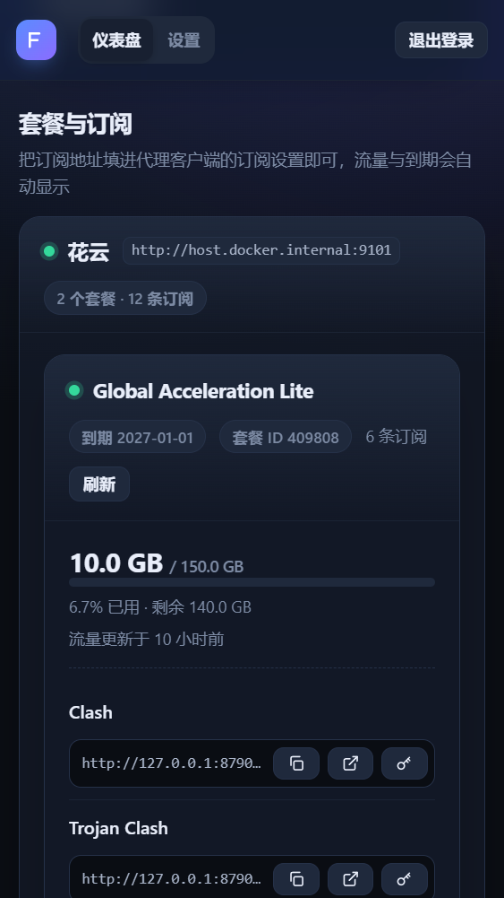
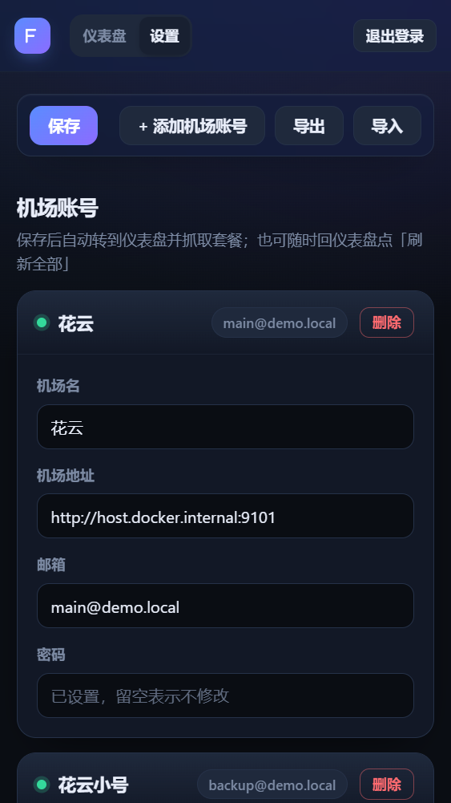

# FlowerCloud 订阅助手

自动登录花云抓取套餐与订阅链接，向代理客户端提供**长期稳定的订阅地址**与流量信息。

## 快速开始（Docker Compose）

```yaml
name: flowercloud-helper

services:
  flowercloud-helper:
    image: ghcr.io/demojameson/flowercloud-helper:latest
    container_name: flowercloud-helper
    restart: unless-stopped
    init: true
    stop_grace_period: 20s
    depends_on:
      - flaresolverr
    ports:
      - "8787:8787"
    volumes:
      - ./data:/data
    environment:
      TZ: "Asia/Shanghai"
    #  固定对外订阅地址前缀，如 https://xxx.xxx.com
    #  PUBLIC_URL: ""
    #  FLARESOLVERR_URL: "http://flaresolverr:8191"
    #  FLARESOLVERR_TIMEOUT_MS: "120000"

  # 用于过 CF 验证
  flaresolverr:
    image: ghcr.io/flaresolverr/flaresolverr:latest
    container_name: flowercloud-flaresolverr
    restart: unless-stopped
    # Chromium 渲染需要，按需分配上限给大不占实际内存
    shm_size: '1g'
```

`docker compose up -d` 后访问 `http://<主机IP>:8787`：

1. 首次访问进入「首次设置」页，设置管理口令（也可一键随机生成）
2. 「设置」页填写机场地址、邮箱、密码，保存后自动登录并抓取套餐
3. 仪表盘复制订阅地址，填进代理客户端（Clash Verge / FlClash / Stash / Surge / PassWall 等）

## 界面

<div align="center">
  
  
</div>

- **左 · 仪表盘** —— 按机场账号分组列出套餐、流量与到期，每条订阅一个独立地址，可单独复制或轮换 Token。
- **右 · 设置页** —— 填机场地址、邮箱、密码；密码留空表示不修改。保存后自动转到仪表盘开始抓取。

<sub>截图取自本地 mock 环境（`npm run dev`），数据为演示数据。</sub>

## 环境变量

全部有默认值，无需配置即可跑；需要覆盖时在 compose 的 `environment` 里取消注释或自行添加。

| 变量 | 默认 | 说明 |
|---|---|---|
| `PORT` | `8787` | 监听端口 |
| `CONFIG_FILE` | `<项目>/data/config.json`（镜像内 `/data/config.json`） | 业务配置文件路径 |
| `PUBLIC_URL` | 空 | 对外订阅地址前缀（如 `https://sub.example.com`）。设置后复制的订阅地址永远用它，不跟随打开管理页用的 Host |
| `FLARESOLVERR_URL` | `http://flaresolverr:8191` | FlareSolverr 地址 |
| `FLARESOLVERR_TIMEOUT_MS` | `120000` | 单次请求 FlareSolverr 的最长等待 |
| `SESSION_TTL_HOURS` | `12` | 管理会话有效期 |
| `SESSION_SUFFIX` | `default` | FlareSolverr 会话名后缀，同机多实例时区分 |
| `SUB_TIMEOUT_MS` | `60000` | 订阅回源拉取超时 |
| `BASE_URL` | `https://api-flowercloud.com` | 订阅回源时 referer 的兜底机场地址（正常走各账号配置里的地址） |
| `HOST_REWRITE` | `on` | 节点域名替换（见下）。设 `off` 关闭 |
| `HOST_MAP` | 空 | 手动补充映射 `"占位域名=真实域名,..."`，供 base64 订阅使用 |
| `DEBUG_DIR` | `<项目>/data/debug`（镜像内 `/data/debug`） | 调试文件目录，管理页 `/api/debug` 只读列出（需手动放置） |

## 节点域名替换

机场下发的订阅里，节点的 `server` 往往是一个**占位域名**，真正能连的入口域名只出现在 hosts 映射里：

```yaml
proxies:
  - {name: "香港 1", server: aaaa1111-2222.placeholder.example.com, port: 10014, ...}
hosts:
  aaaa1111-2222.placeholder.example.com: bbbb3333-4444.real-entry.example.net
```

客户端必须支持并启用了 hosts 才能连上（Clash 要 `use-hosts`，sing-box 之类内核干脆没有 hosts 概念），否则一律握手失败。

本项目在转发订阅前把映射「落地」：删掉映射条目本身，再把正文里所有占位域名替换成真实域名。客户端拿到的配置里 `server` 已经是真实入口域名，不再依赖 hosts。

识别的写法：

| 客户端 | 映射写法 |
|---|---|
| Clash / Mihomo | `hosts:` → `a.com: b.com` |
| Surge / Surfboard / Shadowrocket / Loon | `[Host]` → `a.com = b.com` |
| Quantumult X | `[dns]` → `alias=/a.com/b.com` |

几个边界：

- **通用订阅零影响** —— 没有这类映射时原样转发，行为与以前完全一致
- 值不是裸域名的映射（`= server:1.1.1.1`、`= system`）属于机场自带的 DNS 分流，一律保留不动
- hosts 段里若还有其它非映射条目，`hosts:` 键名保留；删空时才连键名一起去掉
- base64 订阅（v2ray / sing-box 那种编码文本）读不到 hosts 段，需要手填 `HOST_MAP`
- 改写失败时退回原样转发，不会连累订阅本身

`HOST_MAP` 示例：

```yaml
environment:
  HOST_MAP: "aaaa1111-2222.placeholder.example.com=bbbb3333-4444.real-entry.example.net"
```

## 环境变量之外的其它在网页里配

机场账号、套餐、订阅 token 全部存于 `data/config.json`，通过管理页读写；支持导出 / 导入迁移。

忘记管理口令：打开 `config.json` 的 `adminPassword` 字段直接查看，或运行 `npm run password`。

## 安全模型

| 接口 | 鉴权 |
|---|---|
| `/sub/<key>?token=...` | 每条订阅独立 token（客户端用） |
| `/status`、`/refresh` | 管理会话，或任意一条订阅的有效 token |
| `/dashboard`、`/api/*` | 管理会话（口令登录，HMAC 签名 Cookie） |

- 登录限流：10 次失败锁 5 分钟（按客户端 IP）
- 会话 Cookie：`HttpOnly` + `SameSite=Strict`，HTTPS 下自动加 `Secure`；登出服务端注销，重启全部失效
- 写操作同源校验（CSRF 双保险），严格 CSP，无内联脚本
- 仅当请求确实来自内网 / 回环（即反代）时才信任 `X-Forwarded-*`

## License

[MIT](LICENSE)
